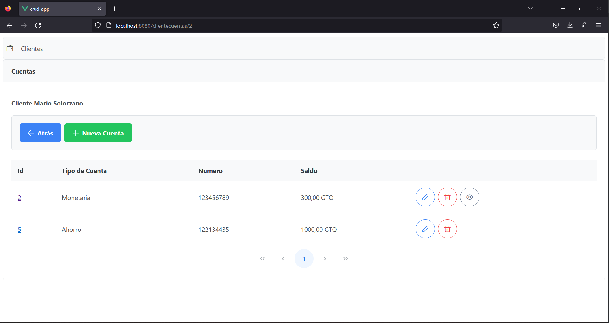

# Manual de Usuario

## Descripción General del Sistema

El Sistema Web de Mantenimientos y Asignación de Chequeras es una plataforma diseñada para brindar a los usuarios una herramienta eficiente y segura para administrar clientes, tipos de cuentas bancarias, chequeras y cheques. 

# Pantalla Clientes

Esta es la pantalla principal del sistema. En ella se listan todos los clientes que se encuentran registrados con todos sus datos. Asimismo en esta pantalla se pueden realizar todas las acciones correspondientes a manejo de clientes. 

Los datos de los clientes se muestran en formato de tabla, en cada fila de esta tabla se cuenta con 3 botones para realizar el manejo de clientes. 

## Acciones de Cliente

### Botón Editar Cliente

Este botón sirve para editar la información de un cliente. Al presionarlo se abrirá un cuadro de diálogo con la información actual del cliente, la cual podrá ser editada en el mismo cuadro de diálogo. Al finalizar de editar la información se debe presionar Guardar para que los cambios se apliquen.

### Botón Eliminar Cliente

Este botón sirve para eliminar un cliente del registro. Al presionarlo se abrirá un cuadro de diálogo en el que se debe confirmar que se desea eliminar el cliente. Al confirmarlo el cliente desaparecerá de la lista.

## Botón Ver Cuentas

Este botón sirve para acceder a las cuentas que tiene el cliente asociadas. Al presionarlo este lleva a la pantalla de cuentas del cliente.

# Botón Nuevo Cliente

Este botón, que se encuentra en la parte superior de la pantalla, sirve para registrar un nuevo cliente. Al presionarlo se abre un cuadro de diálogo con un formulario para ingresar la información del nuevo cliente.

# Pantalla de Cuentas

Esta es la pantalla de cuentas asociadas al cliente seleccionado. Aquí se listan todas las cuentas vinculadas al cliente, junto con sus respectivos detalles e información relevante.

Los datos de las cuentas se presentan en formato de tabla, donde cada fila contiene los detalles de una cuenta específica. Además, se proporcionan acciones que se pueden realizar para administrar las cuentas.

## Acciones de Cuenta

### Botón Editar Cuenta

Este botón sirve para editar los datos de una cuenta. El único dato que puede ser modificado aquí es el saldo de la cuenta. Simulando un retiro de dinero.

### Botón Eliminar Cuenta

Este botón sirve para eliminar una de un cliente. Al presionarlo se abrirá un cuadro de diálogo en el que se debe confirmar que se desea eliminar la cuenta. Al confirmarlo la cuenta desaparecerá de la lista.

### Botón Ver Chequeras

Este botón sirve para acceder a las chequeras que tiene la cuenta asociadas. Al presionarlo este lleva a la pantalla de chequeras de la cuenta. Este botón está disponible únicamente para las cuentas de tipo Monetarias.

## Botón Nueva Cuenta

Este botón, ubicado en la parte superior de la pantalla, permite agregar una nueva cuenta para el cliente seleccionado. Al hacer clic en él, se abrirá un cuadro de diálogo o formulario donde se puede ingresar la información necesaria para crear una nueva cuenta. Se podrá seleccionar entre 2 tipos de cuenta, de Ahorro y Monetaria.

## Botón Volver (Atrás)

Este botón permite regresar a la pantalla principal de clientes. Al seleccionarlo, se redirige al usuario a la lista de clientes registrados.

# Pantalla de Chequeras

Esta es la pantalla de chequeras asociadas a la cuenta seleccionada. Aquí se listan todas las chequeras vinculadas a la cuenta, junto con sus respectivos detalles e información relevante.

Los datos de las chequeras se presentan en formato de tabla, donde cada fila contiene los detalles de una chequera específica. Además, se proporcionan acciones que se pueden realizar para administrar las chequeras.

## Acciones de Chequeras

### Botón Eliminar Chequera

Este botón sirve para eliminar una chequera de una cuenta. Al presionarlo se abrirá un cuadro de diálogo en el que se debe confirmar que se desea eliminar la chequera. Al confirmarlo la chequera desaparecerá de la lista.

### Botón Ver Cheques

Este botón sirve para acceder a los que se han emitido de la chequera seleccionada. Al presionarlo este lleva a la pantalla de cheques de la chequera.

## Botón Nueva Chequera

Este botón, ubicado en la parte superior de la pantalla, permite emitir un nuevo cheque para la cuenta seleccionada. Al hacer clic en él, se abrirá un cuadro de diálogo o formulario donde se puede ingresar la información necesaria para emitir un cheque.

## Botón Volver

Este botón permite regresar a la pantalla de cuentas. Al seleccionarlo, se redirige al usuario a la lista de cuentas de un cliente.

# Pantalla Cheques

Esta es la pantalla de cheques asociados a la chequera seleccionada. Aquí se listan todos los cheques vinculados a la chequera, junto con sus respectivos detalles e información relevante.

Los datos de los cheques se presentan en formato de tabla, donde cada fila contiene los detalles de un cheque específico. Además, se proporcionan acciones que se pueden realizar para administrar los cheques.

## Acciones de Cheques

### Botón Cancelar Cheque

Este botón sirve para cancelar un cheque emitido desde la chequera seleccionada. Al presionarlo, se abrirá un cuadro de diálogo en el que se debe ingresar el número del cheque que se desea cancelar y confirmar la operación. Al confirmarlo, el cheque quedará anulado y ya no será válido para su uso.

### Botón Pagar Cheque

Este botón sirve para registrar el pago de un cheque recibido en la chequera seleccionada. Al presionarlo, se abrirá un cuadro de diálogo o formulario donde se debe ingresar la información necesaria para registrar el pago del cheque, como el número del cheque y los detalles de la transacción.

## Botón Emitir Cheque

Este botón, ubicado en la parte superior de la pantalla, permite generar un nuevo cheque para la chequera seleccionada. Al hacer clic en él, se abrirá un cuadro de diálogo o formulario donde se puede ingresar la información necesaria para crear un nuevo cheque.

## Botón Volver

Este botón permite regresar a la pantalla principal de chequeras. Al seleccionarlo, se redirige al usuario a la lista de chequeras vinculadas a la cuenta seleccionada.